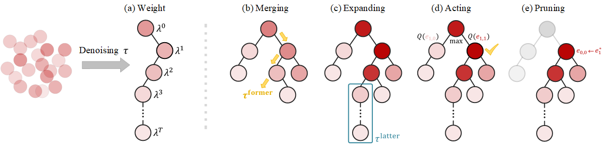

# Resisting Stochastic Risks in Diffusion Planners with the Trajectory Aggregation Tree

This branch contains the implementation of TAT in **Kuka environment**.
<p align="center">
    
</p>

## Using pretrained models

Download kuka pretrained models released by Janner et al. [here](https://www.dropbox.com/s/zofqvtkwpmp4v44/metainfo.tar.gz?dl=0).

## Plan using TAT:
Evaluate TAT on unconditional stacking via
```
python scripts/unconditional_kuka_planning_eval.py --use_tree
```
or conditional stacking via
```
python scripts/conditional_kuka_planning_eval.py --use_tree
```
or rearrangement stacking via
```
python scripts/rearrangment_kuka_planning_eval.py --use_tree
```
Other details are the same as the Diffuser Kuka branch, see the Appendix.

## Citation
```bibtex
@article{feng2024resisting,
  title={Resisting Stochastic Risks in Diffusion Planners with the Trajectory Aggregation Tree},
  author={Feng, Lang and Gu, Pengjie and An, Bo and Pan, Gang},
  journal={arXiv preprint arXiv:2405.17879},
  year={2024}
}
```

## Acknowledgements

This implementation is based on the [Diffuser repo](https://github.com/jannerm/diffuser).

## Appendix

This appendix is a copy from [Diffuser README in kuka branch](https://github.com/jannerm/diffuser/blob/kuka/README.md).

This is the implementation of the robotics experiments for <a href="https://arxiv.org/abs/2205.09991">Planning with Diffusion for Flexible Behavior Synthesis</a> in Pytorch. 


## Usage

First, install and extract the dataset for training and pretrained models from this <a href="https://www.dropbox.com/s/zofqvtkwpmp4v44/metainfo.tar.gz?dl=0">URL</a> in the root directory of the repo.


To train the unconditional diffusion model on the block stacking task, you can use the following command:

```
python scripts/kuka.py
```

You may evaluate the diffusion model on unconditional stacking with

```
python scripts/unconditional_kuka_planning_eval.py
```

or conditional stacking with

```
python scripts/conditional_kuka_planning_eval.py
```

The rewards are not normalized -- you need to divide numbers by 3.0 to get numbers reported in the paper.

